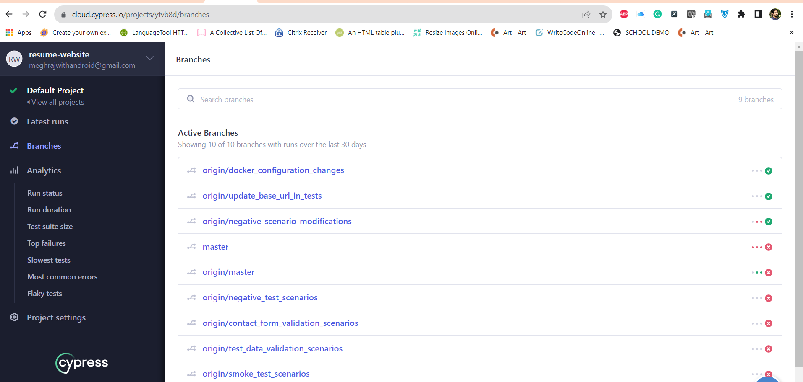
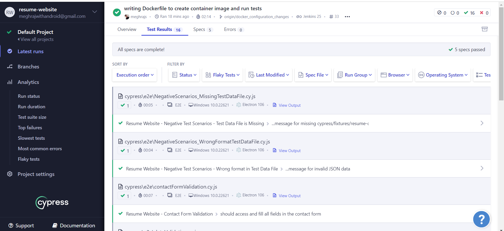
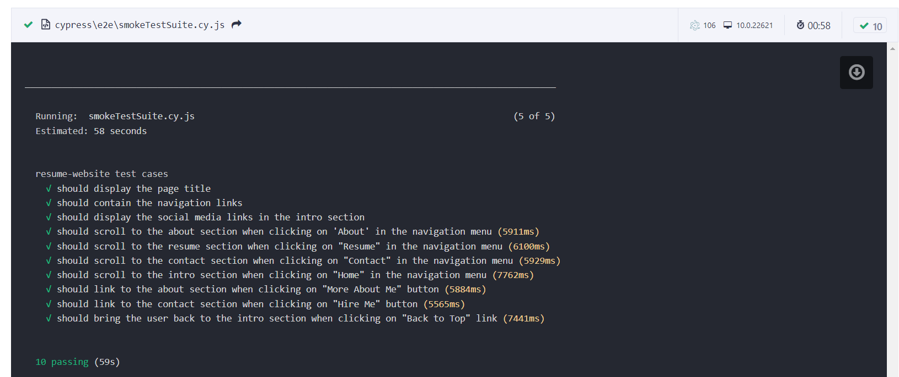

# Single Page Resume Website
- [Introduction](#introduction)
- [Installation]()
  - [Running Locally](#installation)
  - [Docker Container Setup](#docker-container-setup)
- [Application Preview](#application-preview)
- [Application Features](#application-features)
- [Testing Framework and Structure](#testing-framework-and-structure)
- [CI/CD (Jenkins)](#CI/CD(Jenkins))
- [Test Scenario Pass/Fail Dashboard](#test-scenario-passfail-dashboard)


## Introduction
This is an assessment project for building and testing a single-page resume website. The project can be hosted and built on your local machine using an Apache server or configured to run in a Docker container. Detailed requirements can be found in the Requirements.docx file placed at the project root.

## Installation

* Running the website on a local machine would require an Apache web server installed and in a running state. 
* An easy fix can be downloading and installing "XAMMP" as it comes with an Apache server and is easy to start with. 
* Place all the project files within the "htdocs" folder in the "XAMPP" installation directory and visit "http://localhost:8081/resume-website-assessment" from your browser. 
* Make sure to change the port to '81' in http.conf file which can be accessed from the XAMPP control panel. 
* If you are not updating the port, kindly use the default port "8080" in the URL.

### Application Preview


### Application Features
* Single Page Resume Website with Navigation Options
* Separate sections are created to display candidate data
* The '[resume-data.json](resume-data.json)' file provides the data used to dynamically display your personalized resume on the website. Modify this file to showcase your unique skills, experiences, and achievements
* Contact us form fill details and get in touch

## Testing Framework and Structure  
The Single Page Resume Website project utilizes Cypress as the chosen testing framework for automated testing. Cypress is an open-source JavaScript automation tool designed specifically for modern web applications. It offers a range of powerful features that make writing and maintaining tests easier and more efficient.

### Key Benefits of Using Cypress:
* No Explicit Waits: Cypress automatically waits for DOM elements to be available, eliminating the need for explicit wait statements in test scripts. This reduces test flakiness and makes test code cleaner.
* Flake-Free Tests: Cypress retries commands automatically when encountering transient failures, leading to more reliable and flake-free test runs.
* No Network Lag: Cypress directly interacts with the browser and its APIs, enabling faster test execution by bypassing network communication, unlike other tools.
* Snapshots: Cypress automatically takes screenshots and records videos during test execution, making it easier to diagnose and debug failures.
* Shorter Feedback Cycles: With its fast and efficient test execution, Cypress provides developers with quick feedback on their changes, helping them identify and fix issues early in the development process.

Testing artifacts related to test cases/scenarios can be found within the '[Testing Artifacts](Testing Artifacts)' directory of the project.

### CI/CD(Jenkins)
Jenkins is configured/set-up locally and connected via GIT Plugin to fetch and trigger automated test cases.

### Test Scenario Pass/Fail Dashboard
Cypress Dashboard ("https://cloud.cypress.io/") is configured to keep track of each run and provides visibility of pass/fail along with details like:
* GIT Branch from which Test Scenario was Executed
* Execution Date Time
* Pass/Fail Status, along with failure message and screenshot




## Docker Container Setup
Make sure Docker is installed on your machine and also below packages are available.

1. Node.js (v14 or higher)
2. npm (Node Package Manager)

To install project dependencies, run the following command in the project root directory:

 ``` 
npm install
 ```
### Building Docker Image
Run the following command in the project root directory, expecting the previous command is already executed and there were no errors
 ``` 
npm run build
 ```
### Starting Docker Container
Run the following command in the project root directory, expecting the previous command is already executed and there were no errors
 ``` 
npm start
 ```
### Opening Cypress and triggering test execution
Run the following command in the project root directory, expecting the previous command is already executed and there were no errors
 ``` 
npm run cy:open
 ```
If you don't want to open the Cypress UI app and simply wants to trigger the test execution type below command, it will update test status within console.
 ``` 
npm test
 ```
